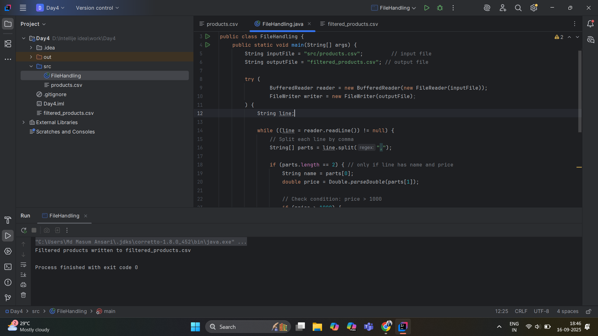

# File Handling in Java

---

## 📖 Project Description
This project demonstrates **File Handling in Java** using `BufferedReader` and `FileWriter`.  
The program reads product details (name and price) from a CSV file, filters products with a price greater than 1000, and writes the filtered results into another CSV file.

---

## 🔑 Key Concepts Used
- **File Handling**  
- **BufferedReader** for reading files line by line  
- **FileWriter** for writing to files  
- **String Splitting** using `.split(",")`  
- **Type Conversion** using `Double.parseDouble()`  
- **Conditional Filtering** (price > 1000)  

---

## 📝 Input File (`products.csv`)
Example contents:
Laptop,55000
Mouse,500
Keyboard,1200
Monitor,9500
Pendrive,750

---

## ⚙️ Program Flow
1. Read each line from `products.csv`.  
2. Split the line into `name` and `price`.  
3. Convert `price` to double.  
4. If `price > 1000`, write the product details into `filtered_products.csv`.  
5. Display a success message.  

---

## 📤 Output File (`filtered_products.csv`)
Example result after filtering:
Laptop,55000
Keyboard,1200
Monitor,9500

---

## 📷 Screenshot

---

## ✅ Conclusion
This project helps in understanding the basics of **reading, processing, and writing files in Java**, which is an essential skill for handling data in real-world applications.

## 👨‍💻 Author
**MD Sohail Ansari**  
